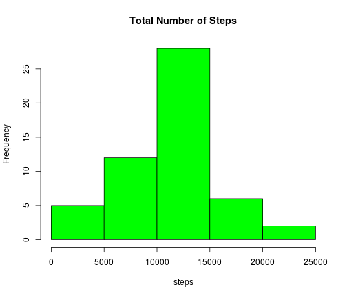
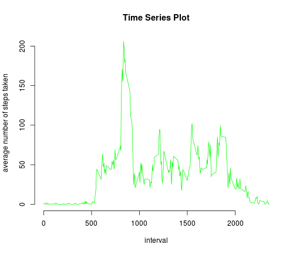
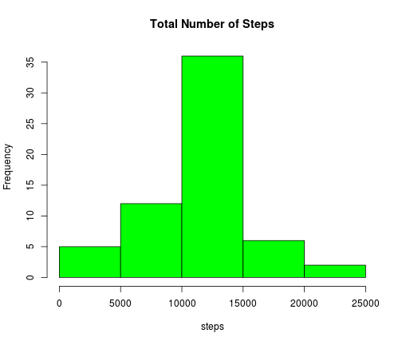
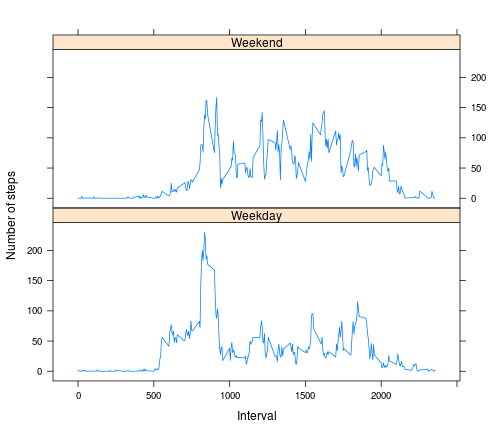

# Reproducible Research: Peer Assessment 1


## Loading and preprocessing the data

```r
library(plyr)
library(lattice)
filename <- "activity"
filenametxt <- paste(filename, ".csv", sep="")
filenamezip <- paste(filename, ".zip", sep="")
# download and/or unzip file if necessary
if (!file.exists(filenametxt))
{
    if (!file.exists(filenamezip))
    { 
        download.file("http://d396qusza40orc.cloudfront.net/repdata%2Fdata%2Factivity.zip", filenamezip)
    }
    unzip(filenamezip)
}
# read raw data if necessary
#if (!exists("dataActMon") | is.null(dataActMon))
#{
    dataActMon <- read.csv(filenametxt)
#}
# filter data based on target criteria
dataActMonClean <- dataActMon[!is.na(dataActMon$steps),]
```


## What is mean total number of steps taken per day?

```r
# Make a histogram of the total number of steps taken each day
dataActMonSum <- tapply(dataActMonClean$steps, dataActMonClean$date, sum)
hist(as.numeric(dataActMonSum), col="green", xlab="steps", main="Total Number of Steps", cex=0.75)
```

 

```r
# Calculate and report the mean and median total number of steps taken per day
summary(dataActMonSum)
```

```
##    Min. 1st Qu.  Median    Mean 3rd Qu.    Max.    NA's 
##      41    8840   10800   10800   13300   21200       8
```


## What is the average daily activity pattern?

```r
# Make a time series plot (i.e. type = "l") of the 5-minute interval (x-axis) and the average number of steps taken, averaged across all days (y-axis)
dataActMonIntervals <- unique(dataActMonClean$interval)
dataActMonIntervalsRelevant <- c(0, 500, 1000, 1500, 2000)
dataActMonMean <- tapply(dataActMonClean$steps, dataActMonClean$interval, mean)
plot(dataActMonIntervals, dataActMonMean, type="l", xlab="interval", ylab="average number of steps taken", main="Time Series Plot", cex=0.75, col="green", axes=F)
axis(1, at=dataActMonIntervalsRelevant, labels=dataActMonIntervalsRelevant)
axis(2)
```

 

```r
# Which 5-minute interval, on average across all the days in the dataset, contains the maximum number of steps?
paste("5-minute interval:", rownames(dataActMonMean)[arrayInd(which.max(dataActMonMean), dim(dataActMonMean))], "contains the maximum number of steps:", max(dataActMonMean))
```

```
## [1] "5-minute interval: 835 contains the maximum number of steps: 206.169811320755"
```


## Imputing missing values

```r
# Calculate and report the total number of missing values in the dataset (i.e. the total number of rows with NAs)
paste("Total number of rows with NAs:", nrow(dataActMon) - nrow(dataActMonClean))
```

```
## [1] "Total number of rows with NAs: 2304"
```

```r
# Devise a strategy for filling in all of the missing values in the dataset. The strategy does not need to be sophisticated. For example, you could use the mean/median for that day, or the mean for that 5-minute interval, etc.
# Create a new dataset that is equal to the original dataset but with the missing data filled in.

# THE SELECTED STRATEGY: "the mean for that 5-minute interval" which produces similar results to
# those when NAs are excluded (i.e. only completed cases are considered)
interpolate.steps <- function(x)
{
    # print(mean(x, na.rm=TRUE))
    ifelse(is.na(x), mean(x, na.rm = TRUE), x)
}
dataActMonInterp <- ddply(dataActMon, ~ interval, transform, steps=interpolate.steps(steps))
# Make a histogram of the total number of steps taken each day and Calculate and report the mean and median total number of steps taken per day. Do these values differ from the estimates from the first part of the assignment? What is the impact of imputing missing data on the estimates of the total daily number of steps?
# Make a histogram of the total number of steps taken each day
dataActMonInterpSum <- tapply(dataActMonInterp$steps, dataActMonInterp$date, sum)
hist(as.numeric(dataActMonInterpSum), col="green", xlab="steps", main="Total Number of Steps", cex=0.75)
```

 

```r
# Calculate and report the mean and median total number of steps taken per day
summary(dataActMonInterpSum)
```

```
##    Min. 1st Qu.  Median    Mean 3rd Qu.    Max. 
##      41    9820   10800   10800   12800   21200
```


## Are there differences in activity patterns between weekdays and weekends?

```r
dataActMonInterp$day <- weekdays(as.Date(dataActMonInterp$date))
weekendLbl <- 'Weekend'
weekdayLbl <- 'Weekday'
interpolate.day <- function(x)
{
    ifelse(x %in% c('Saturday', 'Sunday'), weekendLbl, weekdayLbl)
}
dataActMonInterp <- ddply(dataActMonInterp, ~ date, transform, day=interpolate.day(day))
dataActMonInterpMean <- tapply(dataActMonInterp$steps,
                            list(dataActMonInterp$interval,
                                 factor(dataActMonInterp$day, levels=c(weekdayLbl, weekendLbl))), mean)
# un-normalize step means by interval and day type for easy plotting
dataActMonTmpColNames <- c("step.mean", "interval", "day")
dataActMonTmpMat <- matrix(nrow = nrow(dataActMonInterpMean) * ncol(dataActMonInterpMean), ncol = length(dataActMonTmpColNames))
colnames(dataActMonTmpMat) <- dataActMonTmpColNames
tmpRowNum <- 0
for(day in colnames(dataActMonInterpMean))
{
    for(rowNum in c(1:nrow(dataActMonInterpMean)))
    {
        tmpRowNum <- tmpRowNum + 1
        dataActMonTmpMat[tmpRowNum, 1] <- dataActMonInterpMean[rowNum, day]
        dataActMonTmpMat[tmpRowNum, 2] <- rownames(dataActMonInterpMean)[rowNum]
        dataActMonTmpMat[tmpRowNum, 3] <- day
    }
}
dataActMonTmpDf <- data.frame(dataActMonTmpMat, stringsAsFactors=F)
xyplot(as.numeric(dataActMonTmpDf$step.mean) ~ as.numeric(dataActMonTmpDf$interval) | factor(dataActMonTmpDf$day, levels=c(weekdayLbl, weekendLbl)), layout = c(1, 2), type="l", xlab="Interval", ylab="Number of steps")
```

 

